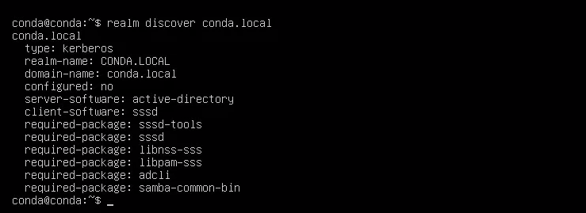
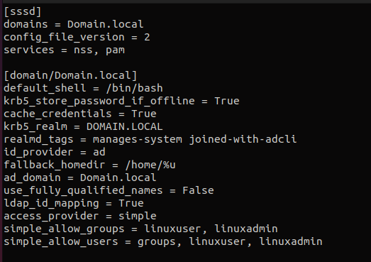
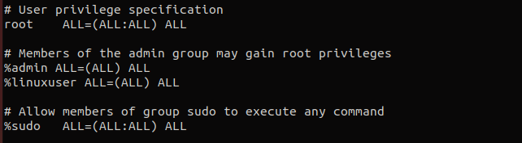

<h1>Atrelar máquina Linux ao Active Directory</h1>
Passo a passo de como configurar uma máquina Linux em um domínio do Active Directory.

<h2>Preparações e instalação de pacotes</h2>
Comece atualizando os pacotes que já possuímos na máquina e, logo após, instale o que realmente precisamos. 

Atualize as dependências com o comando:

Debian 
<code>sudo apt update</code>

RHEL 
<code>sudo yum update</code>

E prossiga com a instalação dos pacotes:

Debian 
<code>sudo apt install -y realmd libnss-sss sssd sssd-tools adcli samba-common-bin oddjob oddjob-	mkhomedir packagekit</code>

RHEL 
<code>sudo dnf install realmd sssd oddjob oddjob-mkhomedir adcli samba-common-tools -y</code>

<h2>Configurando o realm</h2>
De forma resumida, o Realm nos ajuda a descobrir e controlar os domínios que possuímos na máquina.

Para começar, precisamos primeiro descobrir o domínio que estamos procurando. 

Utilize o seguinte comando:

<code>realm discover NOME-DO-DOMINIO</code>

Teremos uma resposta semelhante a esta:

Agora que descobrimos o domínio, precisaremos fazer login nele com um usuário. Utilize o seguinte comando:

<code>sudo realm join -U USUARIO DOMINIO</code>

Se até o momento não ocorreram erros, podemos verificar se realmente estamos conectados, utilizando o comando abaixo para verificar as permissões e grupos do usuário.

<code>id USUARIO@DOMINIO</code>

Outro método para verificar se está tudo ocorrendo corretamente é o seguinte:

<code>realm list</code>

Dessa forma, verificamos se já estamos conectados ao domínio desejado.

<h2>Pam-configs (ubuntu)</h2>

A configuração no pam-configs foi necessária apenas no Ubuntu para que a pasta do usuário seja criada no momento em que ele entra no sistema.

Apenas é necessário executar o comando:

<code>sudo pam-auth-update --enable mkhomedir</code>

<h2>Configurando SSSD</h2>

Devemos acessar o arquivo <code>/etc/sssd/sssd.conf</code> para realizar as modificações. Nele, vamos alterar a opção <code>use_fully_qualified_names</code> de <code>False</code> para <code>True</code>. Com essa opção ativada, os usuários estarão no formato user@domain, em vez de apenas user.

No nosso caso, vamos alterar para True, pois possuímos apenas um AD. No entanto, observe que essa alteração deve ser feita somente se você tiver certeza de que nenhum outro domínio será adicionado à floresta do AD.

Em <code>fallback_homedir = /home/%u@%d</code>, vamos modificar para <code>fallback_homedir = /home/%u</code>. Removendo o "@%d", a pasta do usuário será criada apenas com o nome do usuário.

Na opção <code>access_provider = ad</code>, muda-se para <code>access_provider = simple</code>.

Agora vamos adicionar uma opção que não está presente em nosso arquivo, que é o <code>simple_allow_groups</code>. Nessa opção, vamos adicionar os grupos que temos no AD e desejamos que tenham acesso à máquina Linux.

No nosso caso, temos dois grupos: linuxuser e linuxadmin. Para adicioná-los, devemos incluir <code>simple_allow_groups = linuxuser, linuxadmin</code> no arquivo.

Como resultado, o arquivo ficará da seguinte maneira:

Observação: nos lugares onde está escrito "Domain.local", deve ser o domínio que você está integrando ao sistema. E em "simple_allow_users = groups, linuxuser, linuxadmin" é uma opção adicionada automaticamente no próximo item.

Assim, finalizando o processo de configuração do SSSD, vamos permitir o acesso dos usuários que estão nos grupos que adicionamos em simple_allow_groups. Utilize os seguintes comandos:

<code>realm permit [group]</code>

Exemplo:

<code>realm permit linuxuser</code>

<code>realm permit linuxadmin</code>

<h2>SUDOERS</h2>

Com os processos realizados nos itens acima, já conseguiremos acessar a máquina utilizando o usuário do AD. No entanto, ele não terá acesso root no sistema. Para resolver isso, devemos adicionar os grupos dentro do arquivo /etc/sudoers. O resultado será o seguinte:

Adicionamos o grupo %linuxuser para permitir que todos os usuários do grupo linuxuser possam acessar a máquina e obter acesso root.

---
<h2>Conclusão</h2>
Ao seguir essas etapas, os usuários do Active Directory poderão autenticar-se na máquina Linux e ter os privilégios adequados. Certifique-se sempre de seguir as melhores práticas de segurança ao realizar essas configurações.
