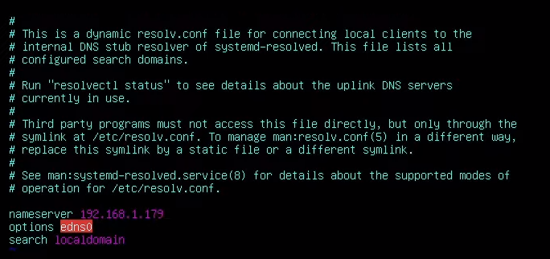
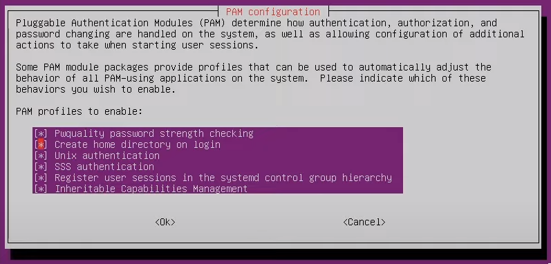

<h1>Atrelar Ubuntu LTS 20.04 ao Active Directory do Windows Server</h1>
Passo a passo de como configurar uma máquina linux (usaremos o Ubuntu LTS 20.04) para ser colocada em um domínio do Windows Server.

<h2>Preparações e pacotes</h2>
Como em qualquer outra configuração grande em um sistema Linux, precisamos começar atualizando os pacotes que já possuimos na máquina, e assim instalar o que precisamos.

Vamos começar atualizando as dependencias com o comando:

<code>sudo apt update</code>

Prosseguimos para a instalação dos pacotes:

<code>sudo apt install -y realmd libnss-sss sssd sssd-tools adcli samba-common-bin oddjob oddjob-mkhomedir packagekit</code>

<h2>Definindo hostname e configurando DNS server </h2>
<h3>hostname</h3>
O sistema já possui um hostname, no qual escolhemos no momento da instalação da OS. Porém, precisamos setar esse nome no hostnamectl para que não tenhamos erros futuros.

Usaremos o comando:

<code>sudo hostnamectl set-hostname HOSTNAME-DA-MAQUINA</code>

Obs.: Caso queira mudar o hostname, pode ser feito modificando o arquivo <code>/etc/hostname</code>.

<h3>DNS server</h3>
Vamos desabilitar os serviços de systemd-resolv.service, pois vamos utilizar nossas configurações do resolv.conf no dominio.

Para desabilitar os serviços:

<code>sudo systemctl disable systemd-resolved.service</code>

<code>sudo systemctl stop systemd-resolved.service</code>

E verificamos se realmente o serviço parou:

<code>sudo systemctl status systemd-resolved.service</code>

Com os serviços parados, vamos modificar as informações do arquivo <code>/etc/resolv.conf</code>, colocando na frente de nameserver o IP de nossa rede de domínio. Por exemplo:

<h2>Configurando o realm</h2>
De forma resumindo, o realm nos ajuda a descobrir e controlar os dominios que possuimos na máquina, fazendo de forma segura a junção. 

Ao começar, precisamos descobrir primeiro o dominio que estamos procurando em questão. Utilizando o comando:

<code>realm discover NOME-DO-DOMINIO</code>

Vamos ter uma resposta como essa:

Agora que estamos conectador ao dominio, vamos precisar logar nele com um usuário. Vamos usar o comando:

<code>sudo realm join -U USUARIO DOMINIO</code>

Se não houve erros até o presente momento, podemos verificar se realmente nos conectamos, usando o comando a baixo para verificar as permissões e grupos do usuário.

<code>id USUARIO@DOMINIO</code>

Outro meio para verificar se está tudo dando certo, é o:

<code>realm list</code>

Assim verificamos se estamos com o domínio que desejamos já conectado.

<h2>pam-configs</h2>
Devemos tomar muito cuidado para mexer nos arquivos de pam-configs, pois qualquer erro pode ser custoso para consertar, levando muitas vezes a quebra da OS.

Para configurar modificamos o arquivo <code>/usr/share/pam-configs/mkhomedir</code>, onde mudamos <code>Default: no</code> para <code>yes</code>, <code>Priority: 0</code> para <code>900</code> e apagamos a linha <code>Session-Interactive-Only: yes</code>. <strong>E não modificamos mais nenhuma informação!</strong>

Outra mudança importante é nas configurações de update do pam, usamos o comando:

<code>sudo pam-auth-update</code>

E aceitamos apenas opção <code>Create home directory on login</code>. A imagem a baixo mostra como fica as opções da interface grafica.

Por fim reiniciamos o serviço sssd, com os comandos:

<code>sudo systemctl restart sssd</code>

E verificamos seu status:

<code>sudo systemctl status sssd</code>

<h2>Conclusão</h2>
Com essas configurações será necessário apenas reiniciar a máquina e já será possivel acessar a máquina com seu usuário do AD.